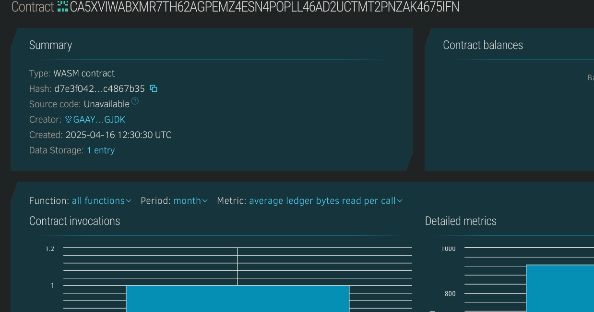

# On-Chain Message Encryptor

## 📌 Project Title
**On-Chain Message Encryptor**

---

## 📄 Project Description
The On-Chain Message Encryptor enables users to store and retrieve encrypted messages on the blockchain using Soroban smart contracts. While encryption is expected to be done off-chain for security reasons, the contract handles secure, permissionless message storage and retrieval in a decentralized environment.

---

## 🎯 Project Vision
The vision is to build a trustless and decentralized message locker where only encrypted messages are stored on-chain. This makes it suitable for use cases like anonymous messaging, token-gated access, or Web3 inbox systems.

---

## 🚀 Key Features
- 🔐 Store encrypted messages associated with user addresses
- 📤 Retrieve encrypted messages securely
- 🛡️ Tamper-proof message persistence on-chain
- 🔗 Blockchain-native way to store sensitive data references

---

## 🔮 Future Scope
- 🧪 Add off-chain encryption/decryption examples in frontend dApp
- ✅ Add signature verification for sender authenticity
- 🧰 Implement TTL or expiration for messages
- 🔒 Introduce access control (only owner can read or update)
- 📨 Create inbox/notifications system for users

## Contract Details
CA5XVIWABXMR7TH62AGPEMZ4ESN4POPLL46AD2UCTMT2PNZAK4675IFN
